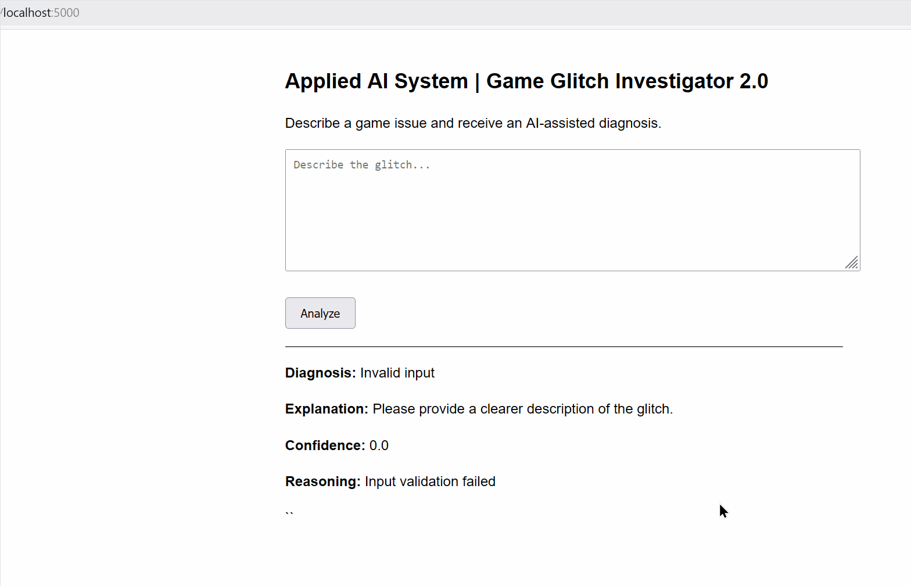

# 🎮 Game Glitch Investigator 2.0: Applied AI System
# 👉 [ReadMe](README.md) | [Model Card](model_card.md) |

### App Web Dashboard


## Original Project
This project extends the **[Game Glitch Investigator (Module 1)](https://github.com/4Fola/ai110-module1show-gameglitchinvestigator-starter/)**, which originally performed simple rule-based analysis of game glitch reports. The prior module was chosen because it is an excellent first based on the following reasoning:
✅ Agentic reasoning
✅ Step-by-step diagnosis
✅ Validation & testing loop
- Easy to explain why the AI’s reasoning is trustworthy
- Natural professional framing (“AI debugging assistant”)
- Clean architecture evolution from a simple prototype


## Overview
Game Glitch Investigator 2.0 is an applied AI system that assists users in diagnosing video game issues by combining **retrieval‑augmented knowledge** with **structured agentic reasoning**. The system explains its decisions, reports confidence, and safely handles uncertainty through explicit guardrails and evaluation.

This project demonstrates practical AI system design with an emphasis on **reliability, transparency, and responsible deployment**.

---

## Project Background
This system extends the **Game Glitch Investigator (Module 1)** project  
(https://github.com/4Fola/ai110-module1show-gameglitchinvestigator-starter),  
which originally performed simple rule‑based classification of glitch reports.

The original project was selected because it naturally supports:
- Step‑by‑step diagnostic reasoning  
- Evidence‑based validation  
- Clear explanation of AI trustworthiness  
- Professional framing as an AI debugging assistant  

---

## System Capabilities
- Diagnoses common game glitches using retrieved knowledge
- Applies agentic reasoning to validate hypotheses
- Explains decisions in human‑readable terms
- Assigns confidence scores based on evidence usage
- Rejects invalid or low‑quality inputs
- Logs system decisions for auditability

The system can be used via:
- A command‑line interface (CLI)
- A minimal Flask‑based web interface

---

## ✨ System Architecture Diagram ✨


## Architecture Overview
The system follows a modular, production‑oriented pipeline:

1. User Input (CLI or Web UI)
2. Input Validation & Guardrails
3. Retrieval of known glitch data (RAG)
4. Agentic reasoning loop (hypothesis → verification)
5. Confidence scoring and structured logging
6. Explainable output

A system architecture diagram is included in the `/assets` directory.

---

## Setup Instructions
```bash
pip install -r requirements.txt
python app/cli.py
```

To run the web interface:
- python app/web.py 
   OR
- python -m app.web

Web UI Should be accessible at (http://localhost:5000/) if all goes well.

## Sample Interactions

Input:
“The game crashes on startup”
Output:
Diagnosis: Corrupted game files or missing dependencies
Confidence: 0.85
Reasoning: Matched known glitch pattern

Input:
“Something strange happens sometimes”
Output:
Diagnosis: Unknown glitch
Confidence: 0.40
Reasoning: No known patterns matched

## Design Decisions

- Retrieval was implemented using transparent keyword matching to improve explainability.
- Agentic reasoning was structured into explicit steps to ensure reliability and testability.
- Confidence scoring was added to communicate uncertainty responsibly.

## Testing Summary

- 3 automated tests implemented
- Known glitch cases passed
- Unknown and invalid inputs were safely handled
- Confidence scores reflected evidence usage

## Reflection
This project demonstrated the importance of grounding AI outputs in evidence, designing for failure,
and explaining uncertainty clearly. Building guardrails and evaluation early improved trustworthiness.
