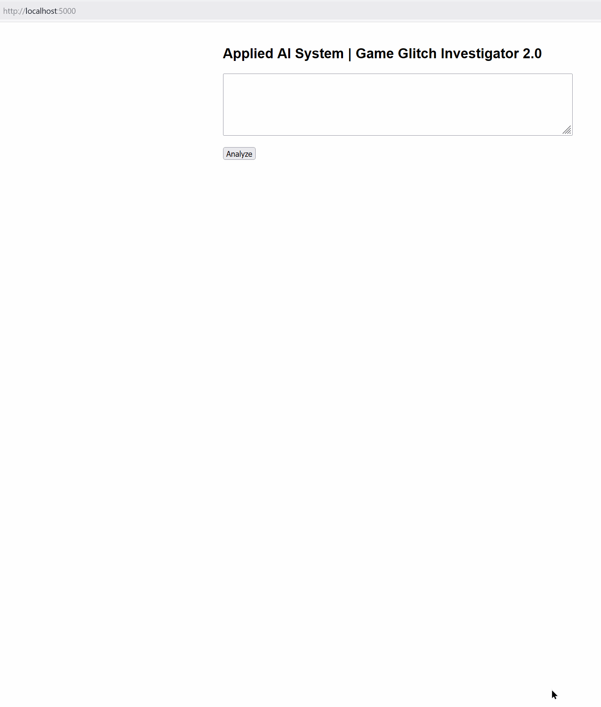
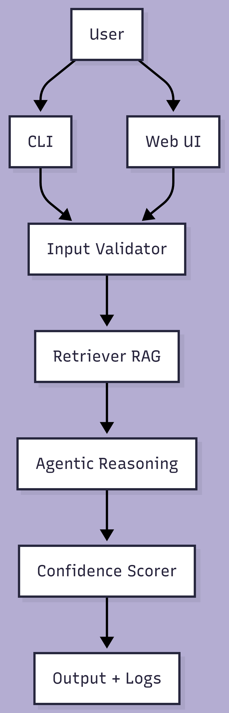

# 🎮 Game Glitch Investigator 2.0: The Impossible Guesser
# 👉 [ReadMe](README.md) | [Model Card](model_card.md) |

# NB:
### App Web Dashboard


## Original Project
This project extends the **[Game Glitch Investigator (Module 1)](https://github.com/4Fola/ai110-module1show-gameglitchinvestigator-starter/)**, which originally performed simple rule-based analysis of game glitch reports.

## Project Summary
This Game Glitch Investigator 2.0 is a hybrid AI system that diagnoses game glitches by combining
retrieval-augmented knowledge with structured agentic reasoning. The system explains its decisions,
scores confidence, and safely handles uncertainty.

## ✨ System Architecture Diagram ✨


## Architecture Overview
The system follows a modular pipeline:
- Input (CLI or Web UI)
- Retrieval of known glitch data (RAG)
- Agentic reasoning loop (hypothesis + verification)
- Confidence scoring and guardrails
- Logged, explainable output.

A system architecture diagram is provided in `/assets`.

## Setup Instructions
```bash
pip install -r requirements.txt
python app/cli.py
```

To run the web interface:
- python app/web.py 
   OR
- python -m app.web

Web UI Should be accessible at (http://localhost:5000/) if all goes well.

## Sample Interactions

Input:
“The game crashes on startup”
Output:
Diagnosis: Corrupted game files or missing dependencies
Confidence: 0.85
Reasoning: Matched known glitch pattern

Input:
“Something strange happens sometimes”
Output:
Diagnosis: Unknown glitch
Confidence: 0.40
Reasoning: No known patterns matched

## Design Decisions

- Retrieval was implemented using transparent keyword matching to improve explainability.
- Agentic reasoning was structured into explicit steps to ensure reliability and testability.
- Confidence scoring was added to communicate uncertainty responsibly.

## Testing Summary

- 3 automated tests implemented
- Known glitch cases passed
- Unknown and invalid inputs were safely handled
- Confidence scores reflected evidence usage

## Reflection
This project demonstrated the importance of grounding AI outputs in evidence, designing for failure,
and explaining uncertainty clearly. Building guardrails and evaluation early improved trustworthiness.


# -------------- NB END: --------------

## 🚨 The Situation

You asked an AI to build a simple "Number Guessing Game" using Streamlit.
It wrote the code, ran away, and now the game is unplayable. 

- You can't win.
- The hints lie to you.
- The secret number seems to have commitment issues.

## 🛠️ Setup

1. Install dependencies: `pip install -r requirements.txt`
2. Run the broken app: `python -m streamlit run app.py`

## 🕵️‍♂️ Your Mission

1. **Play the game.** Open the "Developer Debug Info" tab in the app to see the secret number. Try to win.
2. **Find the State Bug.** Why does the secret number change every time you click "Submit"? Ask ChatGPT: *"How do I keep a variable from resetting in Streamlit when I click a button?"*
3. **Fix the Logic.** The hints ("Higher/Lower") are wrong. Fix them.
4. **Refactor & Test.** - Move the logic into `logic_utils.py`.
   - Run `pytest` in your terminal.
   - Keep fixing until all tests pass!

## 📝 Document Your Experience

- [ ] Describe the game's purpose.
- [ ] Detail which bugs you found.
- [ ] Explain what fixes you applied.

## 📸 Demo

- [ ] [Insert a screenshot of your fixed, winning game here]

## 🚀 Stretch Features

- [ ] [If you choose to complete Challenge 4, insert a screenshot of your Enhanced Game UI here]
